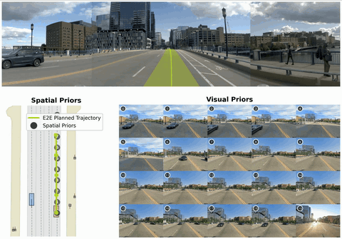

# PriorEye: Geospatial Visual Priors for End-to-End Autonomous Driving

<div align="center">
  
</div>

## Data Preparation

Pick a location on your host for the dataset and for nuPlan maps, then expose them as environment variables. We'll use these throughout the rest of the README.

```bash
export DATA_DIR=/path/to/your/navsim_data   # host folder for navsim/openscene data
export MAPS_DIR=/path/to/nuplan-maps        # host folder for nuPlan maps
```

Download navsim data following the [official guideline](https://github.com/autonomousvision/navsim/blob/main/docs/install.md) and arrange it under `$DATA_DIR`.

nuPlan maps live separately under `$MAPS_DIR`. Download them with the official script: [`download_maps.sh`](https://github.com/autonomousvision/navsim/blob/main/download/download_maps.sh).

### Geospatial Visual Priors

`siglip2_embedding_all.pkl` encodes street-view imagery in SigLIP2 format. Download it into `$DATA_DIR/embedding/siglip2/`:

```bash
pip install gdown
mkdir -p $DATA_DIR/embedding/siglip2
gdown 1hCZtWxHwqWbjrHhpq7b2Eq_Mi0PiY3Q7 -O $DATA_DIR/embedding/siglip2/siglip2_embedding_all.pkl
```

Or download manually from [Google Drive](https://drive.google.com/file/d/1hCZtWxHwqWbjrHhpq7b2Eq_Mi0PiY3Q7/view?usp=drive_link).

After all downloads are done, `$DATA_DIR` should look like this:

```
$DATA_DIR
├── navsim_logs
|    ├── test
|    ├── trainval
|    ├── private_test_hard
|    |         └── private_test_hard.pkl
│    └── mini
├── sensor_blobs
|    ├── test
|    ├── trainval
|    ├── private_test_hard
|    |         ├── CAM_B0
|    |         ├── CAM_F0
|    |         └── ...
|    └── mini
├── navhard_two_stage
|    ├── openscene_meta_datas
|    ├── sensor_blobs
|    ├── synthetic_scene_pickles
|    └── synthetic_scenes_attributes.csv
├── warmup_two_stage
|    ├── openscene_meta_datas
|    ├── sensor_blobs
|    ├── synthetic_scene_pickles
|    └── synthetic_scenes_attributes.csv
├── private_test_hard_two_stage
|    ├── openscene_meta_datas
|    └── sensor_blobs
└── embedding
     └── siglip2
          └── siglip2_embedding_all.pkl
```

## Getting Started

Clone the repository and remember its host path:

```bash
git clone https://github.com/ori-mrg/PriorEye.git ~/repos/PriorEye
export REPO_DIR=~/repos/PriorEye
cd $REPO_DIR
```

Build the docker image:

```bash
./docker/build.sh
```

Run the container, mounting your data, maps, and this repo. Inside the container the paths are fixed (`/dataset`, `/maps`, `/workspace/PriorEye`) so the code and `navsim_export_env.sh` work without changes:

```bash
./docker/run.sh \
    -v $DATA_DIR:/dataset \
    -v $MAPS_DIR:/maps \
    -v $REPO_DIR:/workspace/PriorEye
```

Now you're inside the container. Install the package:

```bash
pip install -v -e .
```

Download DP subscore pickles (used by GTRS-Dense):

```bash
bash download/download_dp_subscore_pickle.sh
```

Download model checkpoints:

```bash
bash download/download_models.sh
```

## Training

This repo provides 4 agents: **transfuser**, **gtrs_dp**, **gtrs_dense**, **drivoR**.

First, cache the dataset. Set the target split and agent inside the script (use `navtrain` for the full training split):

```bash
bash scripts/training/run_dataset_caching.sh
```

Then launch training for the agent of your choice:

```bash
bash scripts/training/run_transfuser_training.sh
bash scripts/training/run_diffusion_policy_training.sh   # gtrs_dp
bash scripts/training/run_gtrs_dense_training.sh
bash scripts/training/run_drivoR_training.sh
```

## Evaluation (navhard-two-stage)

Cache metrics for the `navhard_two_stage` split (set inside the script):

```bash
bash scripts/evaluation/run_metric_caching.sh
```

Then run evaluation for your agent:

```bash
bash scripts/evaluation/transfuser_evaluation.sh
bash scripts/evaluation/gtrs_dp_baseline_evaluation.sh
bash scripts/evaluation/gtrs_dense_evaluation.sh
bash scripts/evaluation/drivoR_evaluation.sh
```

## Evaluation (navtest)

Cache metrics for the `navtest` split (set inside the script):

```bash
bash scripts/evaluation/run_metric_caching.sh
```

Then run the PriorEye evaluation for your agent:

```bash
bash scripts/evaluation/navtest/transfuser_prioreye_evaluation.sh
bash scripts/evaluation/navtest/gtrs_dp_prioreye_evaluation.sh
bash scripts/evaluation/navtest/gtrs_dense_prioreye_evaluation.sh
bash scripts/evaluation/navtest/drivoR_prioreye_evaluation.sh
```

## License

All content in this repository is under the [Apache-2.0 license](https://www.apache.org/licenses/LICENSE-2.0).

## Citation

```bibtex
todo
```

## Acknowledgements

We acknowledge all the open-source contributors for the following projects to make this work possible:

- [NAVSIM](https://github.com/autonomousvision/navsim)
- [GTRS](https://github.com/NVlabs/GTRS)
- [DrivoR](https://github.com/valeoai/DrivoR)
- [SimScale](https://github.com/OpenDriveLab/SimScale)
